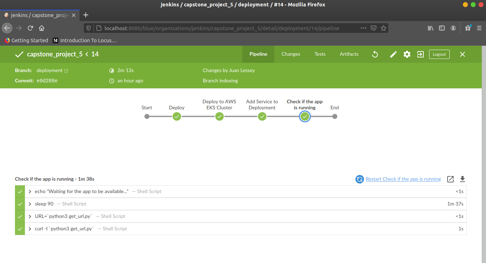
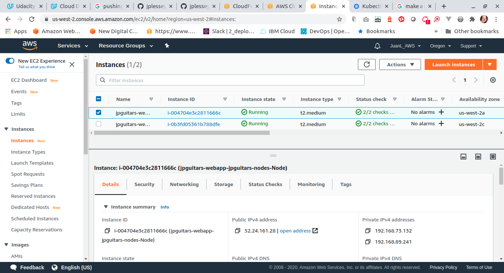

# Udacity Cloud DevOps Nanodregree 2020
## Capstone project

### CD Pipeline

This branch ("deployment") is specifically dedicated to the Continuous Deployment part of the project as an independent pipeline.

Deployment type: rolling deployment

The main stages of this pipeline consisted of:

* Deploying the app to the AWS EKS Cluster
* Adding a Service to the nodes
* Checking if the app is up and running

#### The CD pipeline 

#### AWS EKS EC2 Instances as worker nodes 

Go back to the "master" branch if you want to see the CI pipeline.

