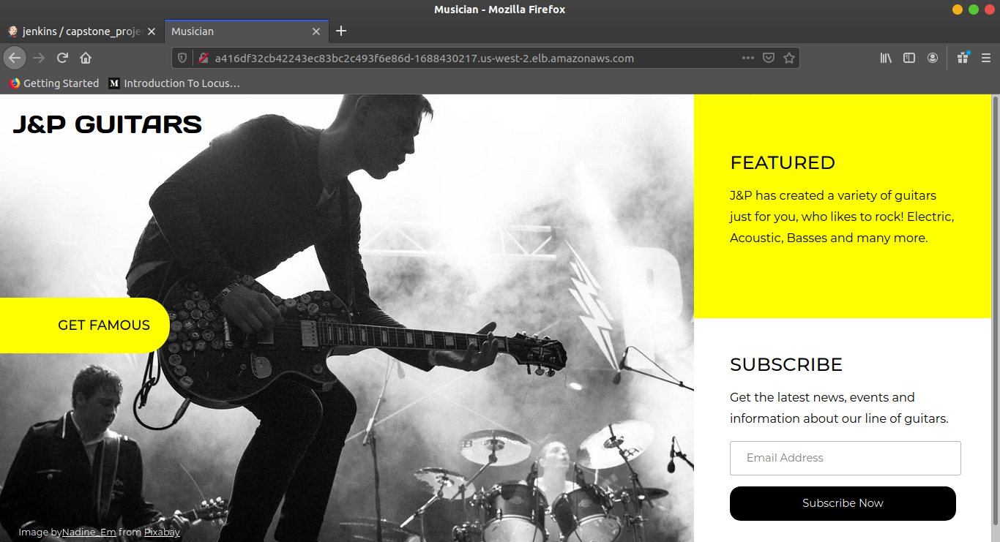
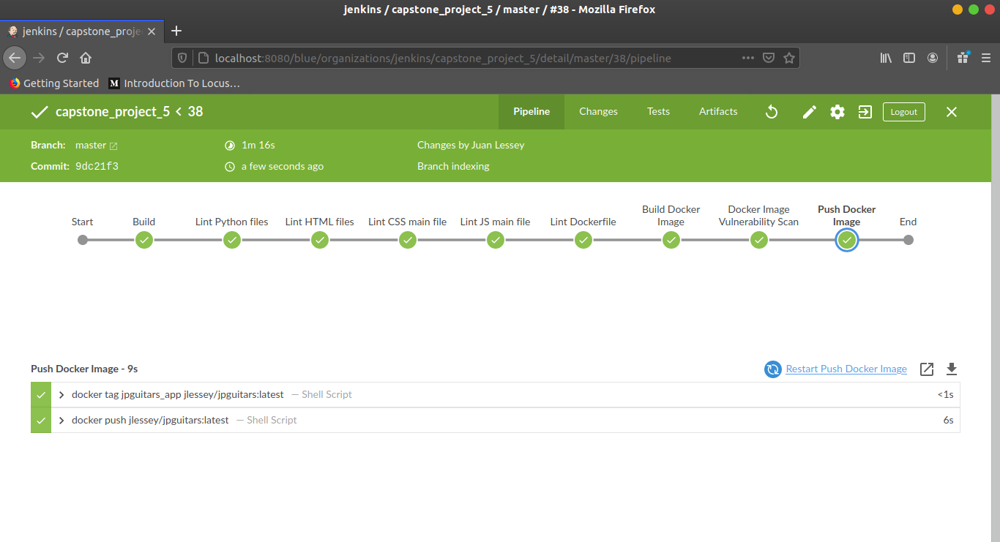
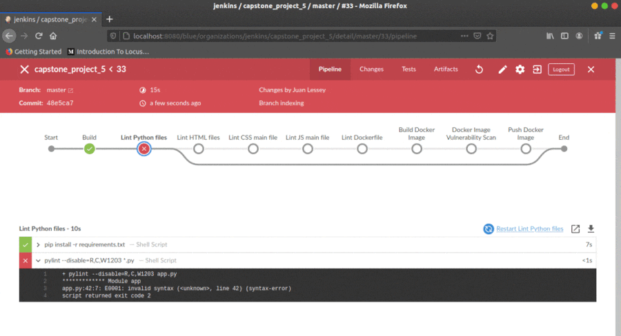

# Udacity Cloud DevOps Nanodregree 2020
## Capstone project

### Summary

The idea of this project was to apply all the skills and knoweledge developed throughout the Cloud DevOps Nanodegree program, which include:

* Working in AWS
* Using Jenkins to implement Continuous Integration and Continuous Deployment
* Building pipelines
* Building Docker containers in pipelines
* Working with CloudFormation to deploy clusters
* Building Kubernetes clusters

I took a web app, performed linting tests on all the code, containerized the application by building a Docker image, pushed the image into a public repo and then deployed the application on a kubernetes cluster provided by the AWS EKS Service. 

The kubernetes cluster consisted of 2 worker nodes created using <a href="https://docs.aws.amazon.com/eks/latest/userguide/getting-started-eksctl.html">eksctl</a>.

### The WebApp

I used a Flask app which consisted of a landing page for an imaginary guitar manufacturing company called "J&P Guitars".
For details about the app, you can go to <a href="https://github.com/jplessey/musician_project">this repo</a>.

### CI/CD Pipelines

The "master" branch of this repo is dedicated to the Continuous Integration pipeline (CI). Check the "deployment" branch to see the Continuous Deployment (CD) pipeline.

### CI Pipeline

The main stages of this pipeline consisted of:

* Linting Python files using <a href="https://www.pylint.org/">Pylint</a> and the <a href="https://plugins.jenkins.io/pyenv-pipeline/">Pyenv Pipeline</a> plugin
* Linting HTML files using <a href="https://www.html-tidy.org/">Tidy</a>
* Linting the CSS main file using <a href="https://stylelint.io/">stylelint</a>
* Linting the Javascript main file using <a href="https://eslint.org/">ESLint</a>
* Linting the Dockerfile using <a href="https://github.com/hadolint/hadolint">Hadolint</a>
* Building the Docker image for the app
* Scanning the Docker image using <a href="https://github.com/aquasecurity/trivy">trivy</a>
* Pushing the Docker image so that it can be deployed later using the CD pipeline

#### The CI pipeline 

---

### Sources:

* Flask and Flask-Mail documentation.
* Jenkins documentation.
* Docker documentation
* Kubernetes documentation
* <a href="https://www.youtube.com/watch?v=aGTOVaVXz7k&list=PLCs_Ba_Xx5B6QNT1QMVrtX-kmGqXXa8YR&index=5&t=0s">Creating Kubernetes cluster in AWS using Eksctl</a>
* <a href="https://www.youtube.com/watch?v=Krpb44XR0bk&list=PLCs_Ba_Xx5B6QNT1QMVrtX-kmGqXXa8YR&index=2&t=1s">Kubernetes Components explained!</a>

